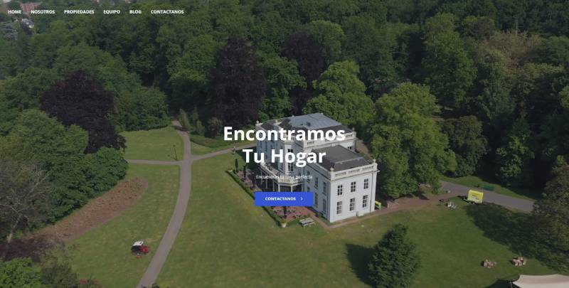
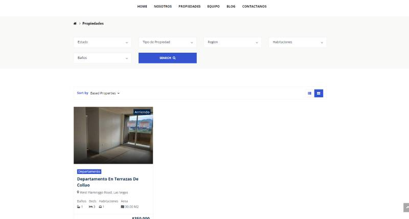

### Plataforma de Real State
Implementacion de una plataforma de real state




Instalacion en Windows:
```
virtualenv env
env\Scripts\activate
python manage.py makemigration
python manage.py migrate
python manage.py runserver
```
